# Module Dependency Graph

Auto-generated by `scripts/render-module-graph.mjs`. Do not edit by hand.

Snapshot of the MoonBit module graph across the workspace (28 modules).

## Visualization

```mermaid
graph LR
  subgraph Core["Core"]
    mizchi_crater_core["crater-core"]
  end
  subgraph Foundation["Foundation"]
    mizchi_crater_css["crater-css"]
    mizchi_crater_dom["crater-dom"]
    mizchi_crater_html_assets["crater-html-assets"]
    mizchi_crater_layout["crater-layout"]
    mizchi_crater_network["crater-network"]
  end
  subgraph Render["Render"]
    mizchi_crater_painter["crater-painter"]
    mizchi_crater_renderer["crater-renderer"]
    mizchi_crater_renderer_inline_style_cache["crater-renderer-inline-style-cache"]
    mizchi_crater_renderer_terminal["crater-renderer-terminal"]
    mizchi_crater_webvitals["crater-webvitals"]
  end
  subgraph Terminal["Terminal"]
    mizchi_crater_painter_terminal["crater-painter-terminal"]
    mizchi_crater_terminal_image_cache["crater-terminal-image-cache"]
    mizchi_crater_terminal_protocol["crater-terminal-protocol"]
  end
  subgraph Browser["Browser"]
    mizchi_crater_browser["crater-browser"]
    mizchi_crater_browser_native["crater-browser-native"]
    mizchi_crater_browser_helpers["crater-browser-helpers"]
    mizchi_crater_browser_http["crater-browser-http"]
    mizchi_crater_browser_http_sqlite["crater-browser-http-sqlite"]
    mizchi_crater_browser_runtime["crater-browser-runtime"]
  end
  subgraph Driver["Driver"]
    mizchi_crater_webdriver_bidi["crater-webdriver-bidi"]
  end
  subgraph Distribution["Distribution"]
    mizchi_crater_js["crater-js"]
    mizchi_crater["crater (umbrella)"]
    mizchi_crater_wasm["crater-wasm"]
  end
  subgraph Test _ Dev["Test / Dev"]
    mizchi_crater_aomx["crater-aomx"]
    mizchi_crater_benchmarks["crater-benchmarks"]
    mizchi_crater_testing["crater-testing"]
    mizchi_crater_tools["crater-tools"]
  end

  mizchi_crater_aomx --> mizchi_crater_dom
  mizchi_crater_aomx --> mizchi_crater_layout
  mizchi_crater_benchmarks --> mizchi_crater_core
  mizchi_crater_benchmarks --> mizchi_crater_browser
  mizchi_crater_benchmarks --> mizchi_crater_css
  mizchi_crater_benchmarks --> mizchi_crater_dom
  mizchi_crater_benchmarks --> mizchi_crater_layout
  mizchi_crater_benchmarks --> mizchi_crater_painter
  mizchi_crater_benchmarks --> mizchi_crater_painter_terminal
  mizchi_crater_benchmarks --> mizchi_crater_renderer
  mizchi_crater_browser --> mizchi_crater_core
  mizchi_crater_browser --> mizchi_crater_aomx
  mizchi_crater_browser --> mizchi_crater_dom
  mizchi_crater_browser --> mizchi_crater_css
  mizchi_crater_browser --> mizchi_crater_layout
  mizchi_crater_browser --> mizchi_crater_painter
  mizchi_crater_browser --> mizchi_crater_renderer
  mizchi_crater_browser --> mizchi_crater_browser_runtime
  mizchi_crater_browser --> mizchi_crater_browser_helpers
  mizchi_crater_browser --> mizchi_crater_browser_http
  mizchi_crater_browser --> mizchi_crater_html_assets
  mizchi_crater_browser --> mizchi_crater_painter_terminal
  mizchi_crater_browser --> mizchi_crater_terminal_image_cache
  mizchi_crater_browser --> mizchi_crater_terminal_protocol
  mizchi_crater_browser_native --> mizchi_crater_browser_runtime
  mizchi_crater_browser_native --> mizchi_crater_dom
  mizchi_crater_browser_helpers --> mizchi_crater_renderer
  mizchi_crater_browser_helpers --> mizchi_crater_css
  mizchi_crater_browser_helpers --> mizchi_crater_dom
  mizchi_crater_browser_helpers --> mizchi_crater_aomx
  mizchi_crater_css --> mizchi_crater_core
  mizchi_crater_dom --> mizchi_crater_core
  mizchi_crater_dom --> mizchi_crater_css
  mizchi_crater_dom --> mizchi_crater_layout
  mizchi_crater_browser_http_sqlite --> mizchi_crater_browser_http
  mizchi_crater_js --> mizchi_crater_core
  mizchi_crater_js --> mizchi_crater_aomx
  mizchi_crater_js --> mizchi_crater_css
  mizchi_crater_js --> mizchi_crater_dom
  mizchi_crater_js --> mizchi_crater_layout
  mizchi_crater_js --> mizchi_crater_painter
  mizchi_crater_js --> mizchi_crater_renderer
  mizchi_crater_js --> mizchi_crater_renderer_terminal
  mizchi_crater_layout --> mizchi_crater_core
  mizchi_crater --> mizchi_crater_css
  mizchi_crater --> mizchi_crater_dom
  mizchi_crater --> mizchi_crater_layout
  mizchi_crater --> mizchi_crater_webvitals
  mizchi_crater --> mizchi_crater_painter
  mizchi_crater --> mizchi_crater_renderer
  mizchi_crater_painter --> mizchi_crater_core
  mizchi_crater_painter --> mizchi_crater_layout
  mizchi_crater_painter_terminal --> mizchi_crater_core
  mizchi_crater_painter_terminal --> mizchi_crater_painter
  mizchi_crater_painter_terminal --> mizchi_crater_layout
  mizchi_crater_painter_terminal --> mizchi_crater_terminal_protocol
  mizchi_crater_renderer --> mizchi_crater_core
  mizchi_crater_renderer --> mizchi_crater_css
  mizchi_crater_renderer --> mizchi_crater_dom
  mizchi_crater_renderer --> mizchi_crater_layout
  mizchi_crater_renderer --> mizchi_crater_painter
  mizchi_crater_renderer --> mizchi_crater_renderer_inline_style_cache
  mizchi_crater_renderer_inline_style_cache --> mizchi_crater_core
  mizchi_crater_renderer_inline_style_cache --> mizchi_crater_css
  mizchi_crater_renderer_terminal --> mizchi_crater_css
  mizchi_crater_renderer_terminal --> mizchi_crater_painter
  mizchi_crater_renderer_terminal --> mizchi_crater_painter_terminal
  mizchi_crater_renderer_terminal --> mizchi_crater_renderer
  mizchi_crater_browser_runtime --> mizchi_crater_dom
  mizchi_crater_testing --> mizchi_crater_core
  mizchi_crater_testing --> mizchi_crater_browser
  mizchi_crater_testing --> mizchi_crater_browser_native
  mizchi_crater_testing --> mizchi_crater_browser_runtime
  mizchi_crater_testing --> mizchi_crater_css
  mizchi_crater_testing --> mizchi_crater_dom
  mizchi_crater_testing --> mizchi_crater_layout
  mizchi_crater_testing --> mizchi_crater_renderer
  mizchi_crater_tools --> mizchi_crater_webdriver_bidi
  mizchi_crater_wasm --> mizchi_crater_js
  mizchi_crater_webdriver_bidi --> mizchi_crater_core
  mizchi_crater_webdriver_bidi --> mizchi_crater_network
  mizchi_crater_webdriver_bidi --> mizchi_crater_dom
  mizchi_crater_webdriver_bidi --> mizchi_crater_layout
  mizchi_crater_webdriver_bidi --> mizchi_crater_painter
  mizchi_crater_webdriver_bidi --> mizchi_crater_renderer
  mizchi_crater_webdriver_bidi --> mizchi_crater_browser
  mizchi_crater_webdriver_bidi --> mizchi_crater_browser_helpers
  mizchi_crater_webvitals --> mizchi_crater_core
  mizchi_crater_webvitals --> mizchi_crater_layout
```

## Modules and incoming-edge counts

| Layer | Module | Dir | In-deg | Internal deps |
| --- | --- | --- | --- | --- |
| Core | `crater-core` | `core` | 13 | — |
| Foundation | `crater-css` | `css` | 10 | crater-core |
| Foundation | `crater-dom` | `dom` | 11 | crater-core, crater-css, crater-layout |
| Foundation | `crater-html-assets` | `html_assets` | 1 | — |
| Foundation | `crater-layout` | `layout` | 12 | crater-core |
| Foundation | `crater-network` | `network` | 1 | — |
| Render | `crater-painter` | `painter` | 8 | crater-core, crater-layout |
| Render | `crater-renderer` | `renderer` | 8 | crater-core, crater-css, crater-dom, crater-layout, crater-painter, crater-renderer-inline-style-cache |
| Render | `crater-renderer-inline-style-cache` | `renderer_inline_style_cache` | 1 | crater-core, crater-css |
| Render | `crater-renderer-terminal` | `renderer_terminal` | 1 | crater-css, crater-painter, crater-painter-terminal, crater-renderer |
| Render | `crater-webvitals` | `webvitals` | 1 | crater-core, crater-layout |
| Terminal | `crater-painter-terminal` | `painter_terminal` | 3 | crater-core, crater-layout, crater-painter, crater-terminal-protocol |
| Terminal | `crater-terminal-image-cache` | `terminal_image_cache` | 1 | — |
| Terminal | `crater-terminal-protocol` | `terminal_protocol` | 2 | — |
| Browser | `crater-browser` | `browser` | 3 | crater-aomx, crater-browser-helpers, crater-browser-http, crater-browser-runtime, crater-core, crater-css, crater-dom, crater-html-assets, crater-layout, crater-painter, crater-painter-terminal, crater-renderer, crater-terminal-image-cache, crater-terminal-protocol |
| Browser | `crater-browser-helpers` | `browser_helpers` | 2 | crater-aomx, crater-css, crater-dom, crater-renderer |
| Browser | `crater-browser-http` | `http` | 2 | — |
| Browser | `crater-browser-http-sqlite` | `http_sqlite` | 0 | crater-browser-http |
| Browser | `crater-browser-native` | `browser/native` | 1 | crater-browser-runtime, crater-dom |
| Browser | `crater-browser-runtime` | `runtime` | 3 | crater-dom |
| Driver | `crater-webdriver-bidi` | `webdriver` | 1 | crater-browser, crater-browser-helpers, crater-core, crater-dom, crater-layout, crater-network, crater-painter, crater-renderer |
| Distribution | `crater (umbrella)` | `.` | 0 | crater-css, crater-dom, crater-layout, crater-painter, crater-renderer, crater-webvitals |
| Distribution | `crater-js` | `js` | 1 | crater-aomx, crater-core, crater-css, crater-dom, crater-layout, crater-painter, crater-renderer, crater-renderer-terminal |
| Distribution | `crater-wasm` | `wasm` | 0 | crater-js |
| Test / Dev | `crater-aomx` | `aomx` | 3 | crater-dom, crater-layout |
| Test / Dev | `crater-benchmarks` | `benchmarks` | 0 | crater-browser, crater-core, crater-css, crater-dom, crater-layout, crater-painter, crater-painter-terminal, crater-renderer |
| Test / Dev | `crater-testing` | `testing` | 0 | crater-browser, crater-browser-native, crater-browser-runtime, crater-core, crater-css, crater-dom, crater-layout, crater-renderer |
| Test / Dev | `crater-tools` | `tools` | 0 | crater-webdriver-bidi |

## Notes

- Internal edges follow `moon.mod.json` `deps` entries that start with `mizchi/crater`.
- Layers are assigned by name in `scripts/render-module-graph.mjs` (`LAYERS`).
- `crater (umbrella)` has no MoonBit packages of its own — it is a registry meta-module aggregating the foundation/render layer.
